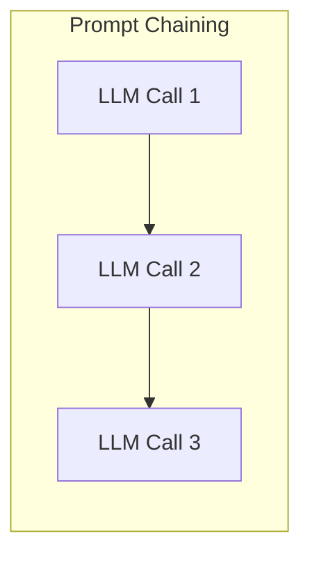
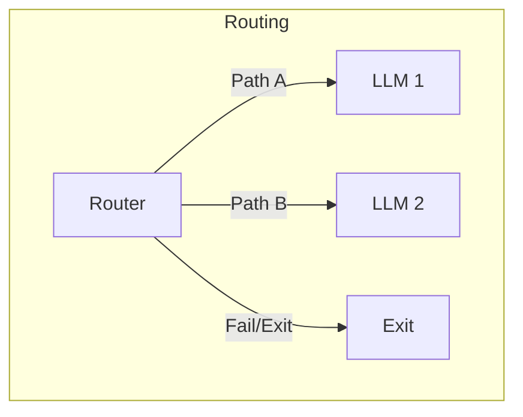
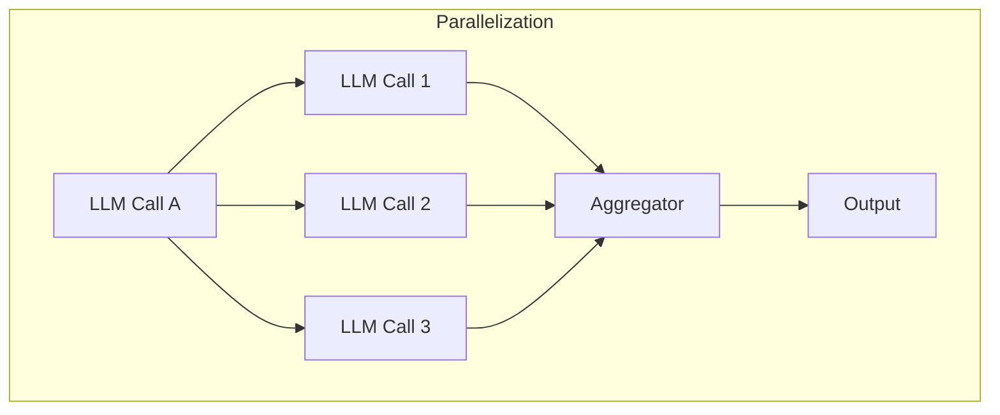
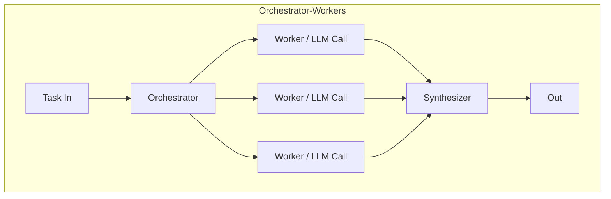
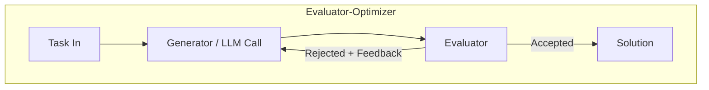
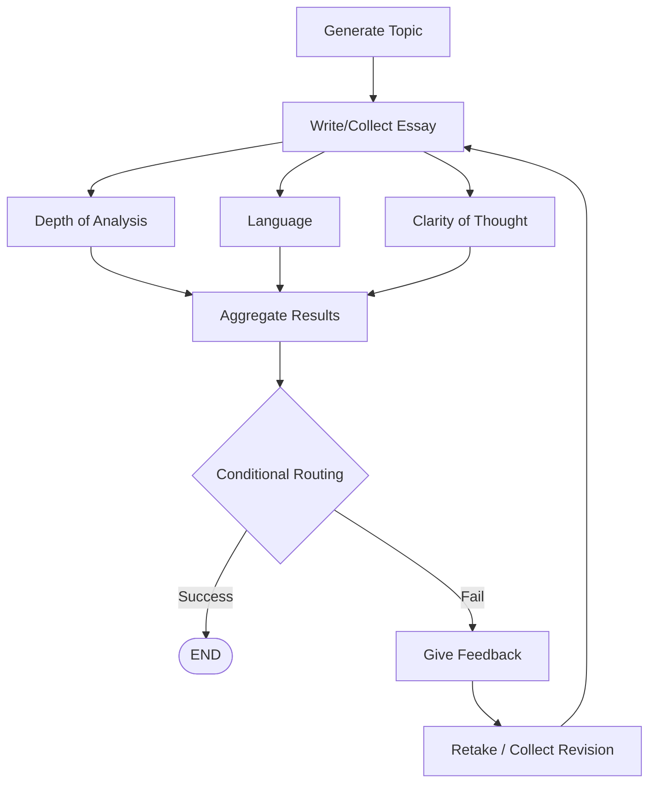
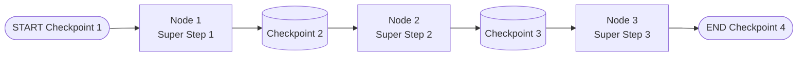
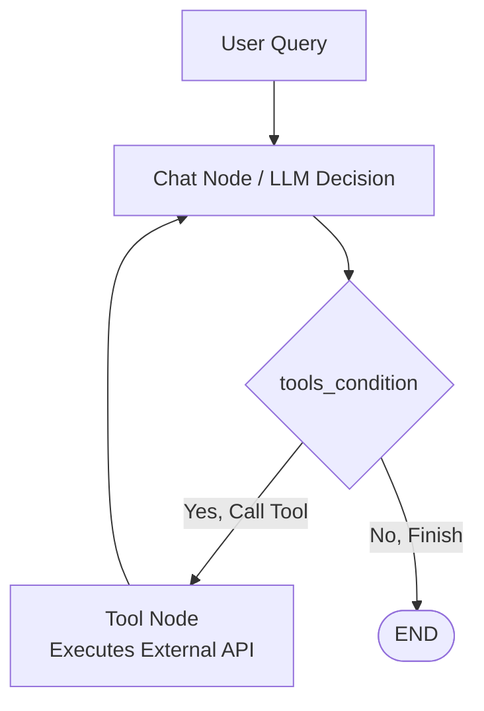

# Comprehensive Guide to Generative and Agentic AI 

This repository contains fundamental concepts, theories, and architectural patterns for building Generative AI and Agentic AI systems, specifically focusing on LangChain, LangGraph, and LangSmith. 

---

## Table of Contents
1. [Generative AI](#generative-ai)
2. [Agentic AI](#agentic-ai)
3. [Components of Agentic Systems](#components-of-agentic-systems)
4. [LangChain & LangGraph](#langchain--langgraph)
5. [LLM Workflows vs. Agents](#llm-workflows-vs-agents)
6. [State and Execution Model](#state-and-execution-model)
7. [Persistence & Memory](#persistence--memory)
8. [Observability (LangSmith)](#observability-langsmith)
9. [Tools in LangGraph](#tools-in-langgraph)
10. [Human-in-the-Loop (HITL)](#human-in-the-loop-hitl)
11. [Subgraphs](#subgraphs)

---

## Generative AI
**Generative AI** refers to a class of Artificial Intelligence models that can create new content—such as text, images, audio, code, or video—that resembles human-created data.

*   **LLM Based apps:** like ChatGPT
*   **Diffusion models:** for images
*   **Code generating LLMs:** like CodeLlama
*   **TTS (Text-to-Speech) models:** like ElevenLabs
*   **Video generation models:** like Sora

**Applications of Gen AI:**
*   Creative and Business writing
*   Software development
*   Customer support
*   Education
*   Designing

### Generative AI vs. Agentic AI
*   Generative AI is about **creating content**; Agentic AI is about **solving a goal**.
*   Generative AI is **creative**; Agentic AI is **cognitive (autonomous)**.
*   Generative AI is a **building block** of Agentic AI.

---

## Agentic AI
Agentic AI is a type of AI that can take up a task or goal from a user and then work towards completing it on its own, with minimal human guidance. It plans, takes action, adapts to changes, and seeks help only when necessary.

### Key Characteristics:

#### 1. Autonomy
The system's ability to make decisions and take actions on its own to achieve a given goal without needing step-by-step human instructions.
*   **Features:** Execution, Decision making, Tool usage.
*   **Autonomy can be controlled via:**
    *   **Permission scope:** Limit what tools or actions the agent can perform independently (e.g., can screen candidates, but needs approval before rejecting).
    *   **Human in the Loop (HITL):** Insert checkpoints where human approval is required before continuing.
    *   **Override Controls:** Allow users to stop, pause, or change the agent's behavior at any time.
    *   **Guardrails/Policies:** Define hard rules or ethical boundaries the agent must follow.
*   **Autonomy can be dangerous:** Applications might autonomously send job offers with incorrect salaries/terms, or shortlist candidates by violating anti-discrimination laws.

#### 2. Goal Oriented
The AI system operates with a persistent objective in mind and continuously directs its actions to achieve that goal, rather than just responding to isolated prompts.
*   Goals act as a compass for autonomy.
*   Goals come with constraints.
*   Goals are stored in core memory.
*   Goals can be altered.

#### 3. Planning
The agent's ability to break down a high-level goal into a structured sequence of actions or subgoals and decide the best path to achieve the desired outcome.
*   **Step 1:** Generate multiple plans.
*   **Step 2:** Evaluate each plan based on:
    *   *Efficiency* (Which is faster?)
    *   *Tool Availability* (Which tools are available?)
    *   *Cost* (Does it require premium tools?)
    *   *Risk*
    *   *Alignment with constraints*
*   **Step 3:** Select the best plan.

#### 4. Reasoning
The cognitive process through which an agentic AI system interprets information, draws conclusions, and makes decisions.
*   **During Planning:** Goal decomposition, Tool selection, Resource estimation.
*   **During Execution:** Decision-making, Error handling.

#### 5. Adaptability
The agent's ability to modify its plans, strategies, or actions in response to unexpected conditions—all while staying aligned with the goal. Triggers include:
*   Failures (e.g., Calendar API is down).
*   External feedback.
*   Changing goals.

#### 6. Context Awareness
The agent's ability to retain and utilize relevant information from ongoing tasks, past interactions, user preferences, and environmental cues to make better decisions throughout a multi-step process.
*   Implemented through **memory** (Short-term memory and Long-term memory).

---

## Components of Agentic Systems
1.  **Brain** (LLM)
2.  **Orchestrator** (LangGraph, Crew AI)
3.  **Tools** (External APIs, RAG, Mail API, etc.)
4.  **Memory**
5.  **Supervisor**

---

## LangChain & LangGraph

### What is LangChain?
LangChain is an open-source library designed to simplify the process of building LLM-based applications. It provides modular building blocks that let you create sophisticated workflows with ease.
*   **Model components:** Provide a unified interface to interact with various LLM providers.
*   **Prompts component:** Helps you engineer prompts.
*   **Retrievers component:** Helps you fetch relevant documents from a vector store.
*   *The biggest offering of LangChain is ChatModels.*

### What is LangGraph?
LangGraph is an orchestration framework for building intelligent, stateful, and multi-step LLM workflows. 
*   It enables advanced features like parallelism, loops, branching, memory, and resumability.
*   It models your logic as a **graph of nodes** (tasks) and **edges** (routing) instead of a linear chain.
*   Ideal for agentic and production-grade AI applications.

---

## LLM Workflows vs. Agents
*   **Workflows:** Systems where LLMs and tools are orchestrated through predefined code paths.
*   **Agents:** Systems where LLMs dynamically direct their own processes and tool usage, maintaining control over how they accomplish tasks.

### Common LLM Workflows











### Graphs, Nodes, and Edges: Example (Essay Evaluation)
*Scenario: The system generates an essay topic, collects the student's submission, and evaluates it in parallel on depth of analysis, language quality, and clarity of thought. Based on the combined score, it either gives feedback for improvement or approves the essay.*



---

## State and Execution Model

### State
In LangGraph, state is the shared memory that flows through your workflow—it holds all the data being passed between nodes as your graph runs.
*Example State Schema:*
```python
essay_text: str
topic: str
depth_score: int
clarity_score: int
total_score: int
feedback: Annotated[list[str], ...]
evaluation_round: int
```
After each node executes, it returns a new state update.

### Reducers
Reducers in LangGraph define how updates from nodes are applied to the shared state. Each key in the state can have its own reducer, which determines whether new data replaces, merges, or appends to the existing value.

### LangGraph Execution Model
1.  **Graph Definition:** You define the State schema, Nodes (functions that perform tasks), and Edges (which node connects to which).
2.  **Compilation:** You call `compile()` on the StateGraph. This checks the structure and prepares it for execution.
3.  **Invocation:** You run the graph with `invoke(initial_state)`. LangGraph sends the initial state to the entry node.
4.  **Super-Step Begin:** Execution proceeds in rounds (super-steps). All active nodes run in parallel and return an update message to the state.
5.  **Message Passing & Node Activation:** Messages are passed downstream via edges. Nodes receiving messages become active for the next round.
6.  **Halting Condition:** Execution stops when no nodes are active and no messages are in transit.

---

## Persistence & Memory
**Persistence** in LangGraph refers to the ability to save and restore the state of a workflow over time. Without it, all values stored in state vanish from RAM after execution. Persistence stores both the final state and intermediate values after each node.

### Checkpointers
Persistence is implemented using Checkpointers. At each super-step, the checkpointer saves the state to a database.



### Threads
Threads refer to different conversations or different users to store different sets of states.

```python
from langgraph.checkpoint.memory import MemorySaver

checkpointer = MemorySaver()
workflow = graph.compile(checkpointer=checkpointer)

# Using Thread ID
config1 = {"configurable": {"thread_id": "1"}}
workflow.invoke({"topic": "pizza"}, config=config1)

# Retrieve final state
workflow.get_state(config1)

# Retrieve all intermediate & final states
list(workflow.get_state_history(config1))
```

### Benefits of Persistence
*   **Short term memory**
*   **Fault tolerance:** If a node crashes, you can resume the workflow at the exact point it crashed.
*   **HITL (Human in the loop)**
*   **Time Travel:** Start the workflow from any past checkpoint (useful for debugging).

---

## Observability (LangSmith)
**Observability** is the ability to understand a system's internal state by examining its external outputs like logs, metrics, and traces. It answers "why" something is happening within a system.

### LangSmith
LangSmith is a unified observability and evaluation platform where teams can debug, test, and monitor AI app performance.

**What does LangSmith Trace?**
1. Input and Output
2. All intermediate steps
3. Latency
4. Token usage
5. Cost
6. Tags
7. Metadata
8. Feedback

**Core Terminology:**
*   **Project:** Your entire LLM application.
*   **Trace:** Every execution of the application.
*   **Run:** Running of every component during a trace.

### Observability in RAG
RAG applications have two main failure modes:
1.  **Retriever Errors:** Wrong/irrelevant docs retrieved.
2.  **Generator Errors:** Model hallucinates or misuses context.
LangSmith automatically records the user query, retrieved documents, final prompt, and LLM response to help pinpoint the error.

### LangGraph + LangSmith
Every graph execution is logged as a trace. Each node (retriever, LLM, tool call) becomes a run inside the trace. You can visualize the path taken and see exactly which branch (conditional/parallel) was executed.

### Other Features of LangSmith
1.  **Monitoring and Alerting:** Aggregates metrics (latency, cost, errors) across many traces. Alerts notify you when metrics drift outside acceptable ranges, helping you catch issues before they impact users.
2.  **Evaluation:** Systematically measure LLM output quality (using LLM-as-a-judge, semantic similarity, or custom Python evaluators). Ensures new prompt/model versions are actually better.
3.  **Prompt Experimentation:** A/B test and compare different prompt versions on the same dataset.
4.  **Dataset Creation and Annotation:** Build datasets for evaluation/fine-tuning.
5.  **User Feedback Integration:** Capture thumbs up/down from users in production, tied directly to the exact trace.
6.  **Collaboration:** Share traces, datasets, and dashboards with team members.

---

## Tools in LangGraph
A **Tool Node** is a prebuilt node type that acts as a bridge between your graph and external tools (functions, APIs, utilities). It listens for tool calls from the LLM (like `search_web()` or `get_weather()`), automatically routes the request, and passes the output back to the graph.

**`tools_condition`:** A built-in conditional edge function that decides if the flow should go to the Tool Node next, or back to the LLM.



---

## Human-in-the-Loop (HITL)
HITL is a design approach where a human actively participates at critical points of the AI workflow to supervise, approve, correct, or guide the model's output. It acts as a "human checkpoint."

**Why HITL Exists:**
*   Help agentic systems
*   Add accountability (Accuracy, Safety, Ethical alignment)
*   Better user experience

**Common HITL Patterns:**
*   Action Approval (Approve/Reject)
*   Output Review / Edit
*   Ambiguity Classification
*   Escalation

**How it works (Interrupt function):**
1.  Pause the workflow using `interrupt()`.
2.  Save the state.
3.  Prepare a message to ask the user.
4.  Message hits the frontend.
5.  User receives the interrupt message and provides input (e.g., "Yes" or "No").
6.  Invoke the workflow again with the user's command.
7.  The workflow resumes from the exact point it paused.

---

## Subgraphs
A subgraph in LangGraph means a graph that is embedded and executed as a node inside another parent graph.

**Advantages:**
*   Modularity
*   Failure Isolation
*   Reusability
*   Maintainability
*   State separation (different states for different tasks)
*   Observability

**Ways to create Subgraphs:**
1.  **Invoke a graph from a node:** Subgraphs are explicitly called from inside a function within the parent graph.
2.  **Directly as a node:** A subgraph is added exactly like a standard node in the parent graph and shares state keys with the parent.
